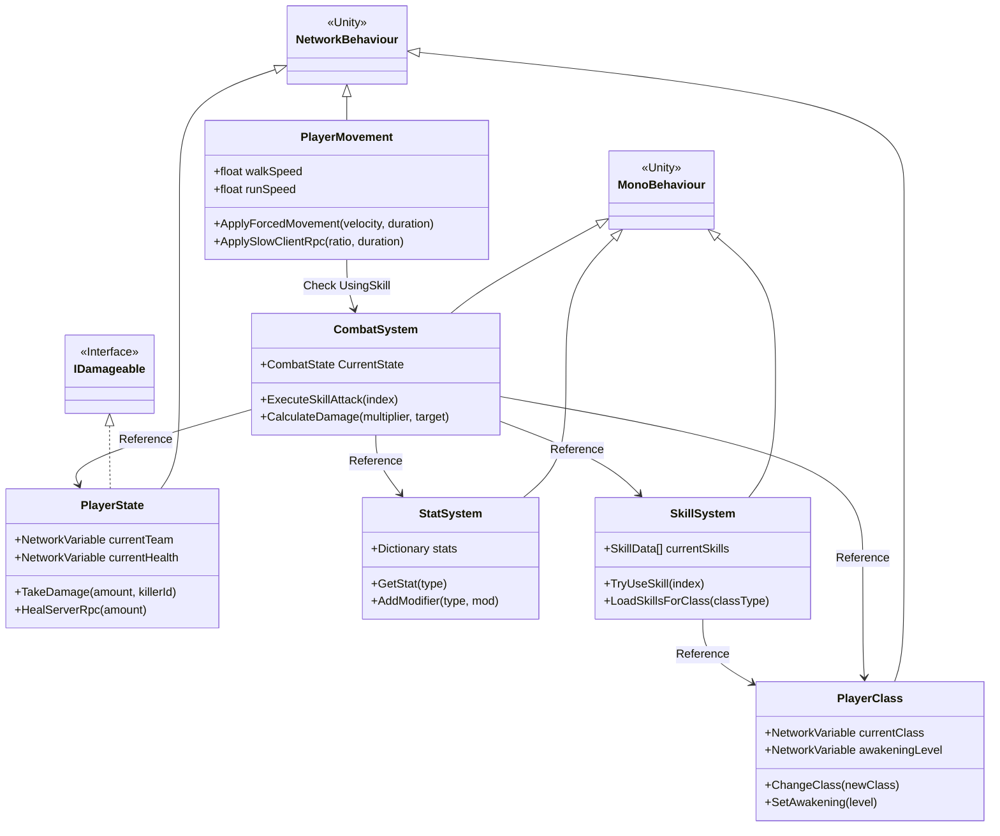
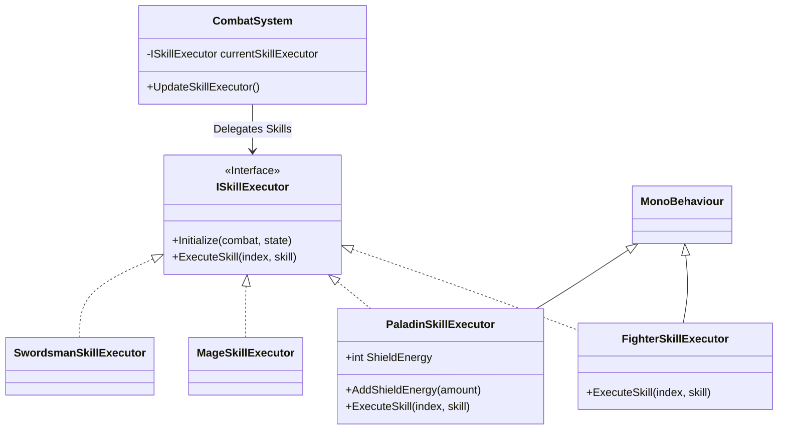
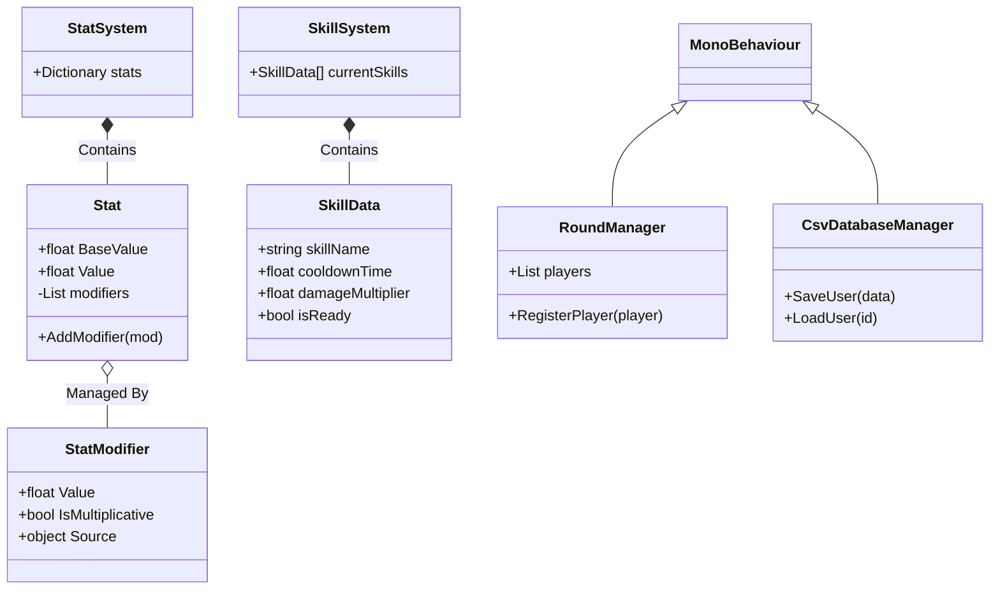
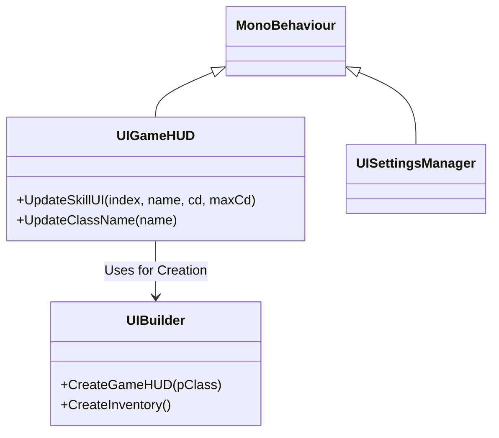

# 프로젝트 클래스 다이어그램 (Class Diagram)

이 문서는 **CSS_RPG** 프로젝트의 주요 클래스 구조와 관계를 Mermaid 클래스 다이어그램으로 시각화한 것입니다. 프로젝트의 확장성과 유지보수를 위해 객체지향 설계 원칙(SOLID)이 적용된 구조를 확인하실 수 있습니다.

## 1. 핵심 플레이어 아키텍처 (Core Player Architecture)

플레이어 캐릭터는 여러 컴포넌트의 조합으로 구성되며, 각 컴포넌트는 독립적인 책임을 가집니다.

Mermaid 소스 코드 보기

---

## 2. 전투 시스템 및 스킬 전략 (Combat & Skill Strategy)

전투 시스템은 `ISkillExecutor` 인터페이스를 통해 직업별 스킬 로직을 분리하여 구현하였습니다 (OCP, DIP 적용).

Mermaid 소스 코드 보기

---

## 3. 데이터 모델 및 관리 (Data Models & Management)

관통력, 치명타 등 복잡한 스탯 연산과 CSV 기반 데이터 관리를 담당하는 구조입니다.

---

## 4. UI 시스템 (UI System)

코드 기반 UI 생성(`UIBuilder`)과 실시간 정보 업데이트(`UIGameHUD`)를 담당합니다.

